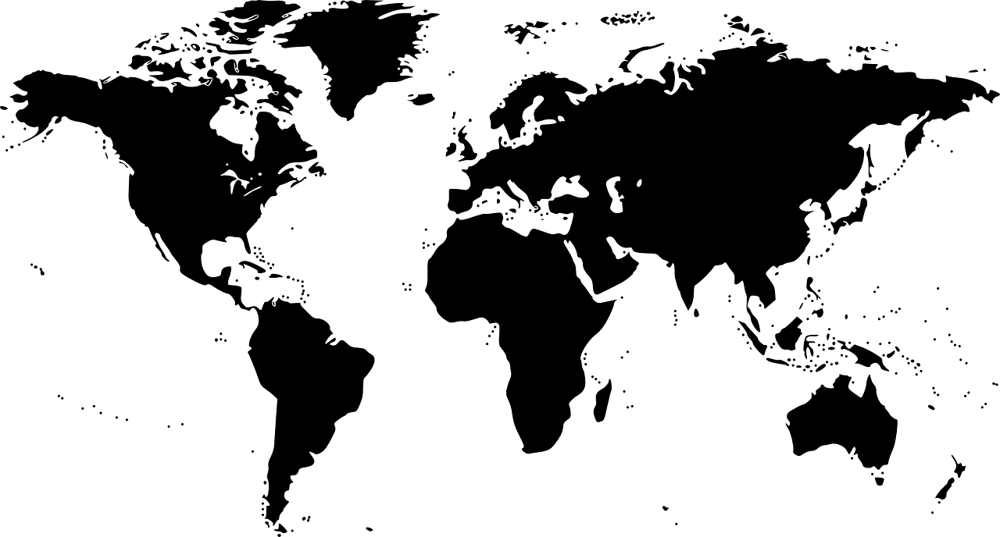
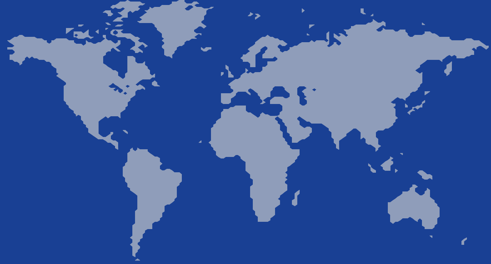
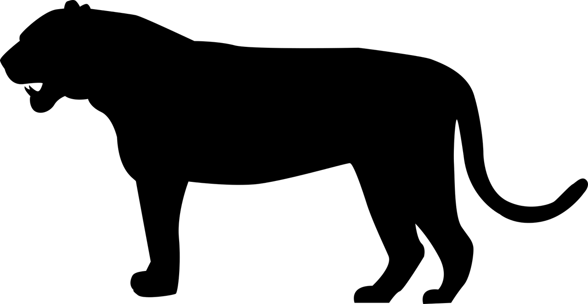
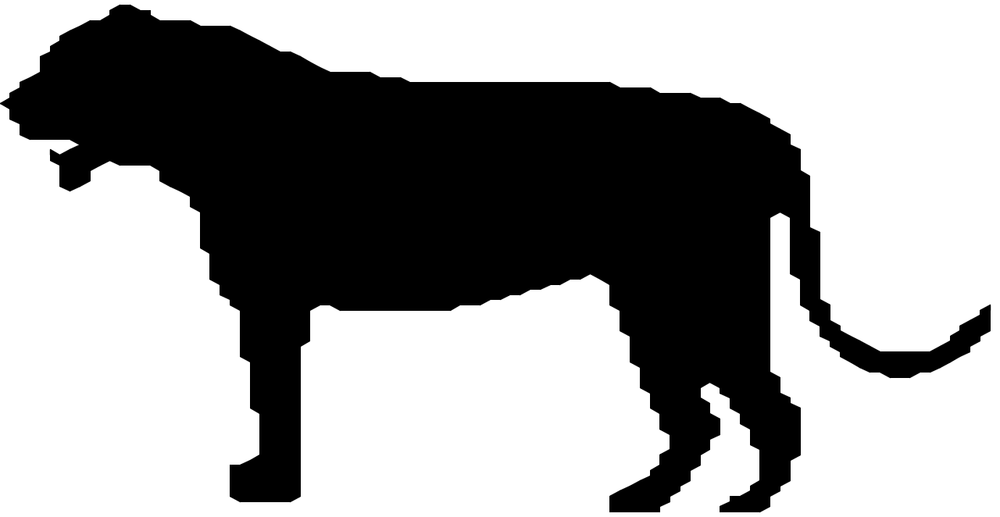

# Poly Image

### Creates a binary poly-image from an input image.

- Works best with binary images as input.

 

#### Samples the image at a specified interval and runs a simple marching squares algorithm to link points together.

 

### Examples:

 

 

### To run:

- Run `pip install -r requirements.txt`
- Run `./polimage.py [filename] (X samples) (Y samples)`
- Output colors can be tweaked in the file
